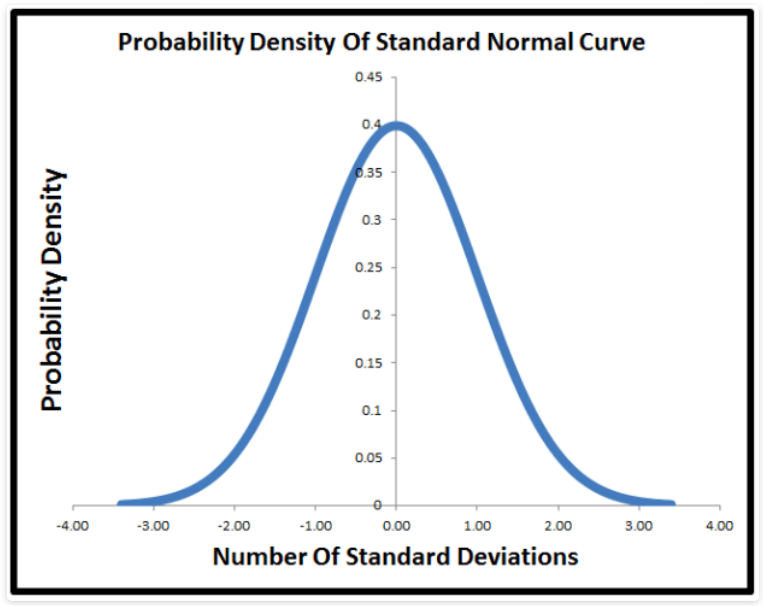

 

# Why we reject Null Hypothesis when $p \leq \alpha$?

Understanding Type I and II errors are of the fundamental importance in interpreting the results of Hypothesis Tests such as A/B testing. 

In Hypothesis Testing, we normally define (somehow arbitrary) significance level ($\alpha$) and use our test statistic to calcuate the well-known $p$-value. If $p \leq \alpha$ we reject the Null Hypothesis, $H_0$, and do not reject it otherwise. 

The reason why we reject $H_0$ when $p \leq \alpha$ was not quite clear to me. As pointed about by a user on [Stackexchange](https://math.stackexchange.com/questions/582945/in-statistics-why-do-you-reject-the-null-hypothesis-when-the-p-value-is-less-th), and with having access to stat books, articles and blog posts online as well as offline resources, we sometimes don't have the guts to question the underlying assumptions and conclusions of well-known mehotds such as A/B testing. Something that feels like everybody knows well except YOU!

I assume the reader is familiar with Hypothesis Testing and to keep this writing short, I only remind the reader few concepts that having the same understanding about them is crucial in understanding the outcome. 

## Basic Concepts
Here I assume the reader is familiar with the basic concpets of Hypothesis Testing and will not go through it. However, I will present a definition or interpretation for the most important ones, to make sure we are on the same page before jumping ahead and making conclusions based on them.

* Significance Level ($ \alpha $)

The probability of rejecting a Null Hypothesis, $H_0$, when $H_0$ is actually true!

* p-value

In A/B testing, the p-value is the probability that we would get the observed difference between the A and B groups (or a more extreme difference) by random chance. 

According to [minitab](http://blog.minitab.com/blog/adventures-in-statistics-2/how-to-correctly-interpret-p-values)
> In technical terms, a p value is the probability of obtaining an effect at least as extreme as the one in your sample data, assuming the truth of the null hypothesis.

And according to the same reference, 
> P values are calculated based on the assumptions that the null is true for the population and that the difference in the sample is caused entirely by random chance. Consequently, P values can’t tell you the probability that the null is true or false because it is 100% true from the perspective of the calculations.

## Where does p-value come from?
p-value is obtained from the normal probability density plot. Let's forget about significance level for a moment and focus on the origin of p-value. We know that for any variable $x$ with normal distribution, the standard score, or z-score is defined as follwoing:

$$
z = \frac{x - \mu}{\sigma}
$$

where $\mu$ and $\sigma$ are the mean and standard deviation of the distribution, respectively. 

This transformation from a normal to standard normal distribution can be best shown in probablity density plot which is the probability density function vs. z-values, as shown in figure below. 

<figcaption>Source: <a href="http://www.fairlynerdy.com/normal-distribution-summary/"> Failry Nerdy </a></figcaption>

One, however, should note that we usually use this plot to find cumulative probabilities. As stated by [Failry Nerdy](http://www.fairlynerdy.com/normal-distribution-summary/)
> You more frequently see the normal curve plotted as a probability density function (i.e. the bell curve). But most of the time when you actually use it, such as to look up the probability of something being more than 2 standard deviations away from the mean by using a Z table, you are actually using the cumulative density function.

A p-value is of the type of **Cumulative Probability**. For instance, for left-tailed test and for any particular value of z-score, namely $z_0$, p-value is the cumulative probability of z values in the $[-\infty, z_0]$ range. Check out the figure below ($z_0$ is Test Statistics). 

<figcaption>Source: <a href="http://www.mathcaptain.com/statistics/p-value.html"> Mathcaptain </a></figcaption>

## Type I error

Now that we have a better understanding of p-value, let's discuss Type I error which is the probability of rejecting the Null Hypothesis (also named the significance level and is denoted by $\alpha$), when it is actually true. The statement "when the Null Hypothesis is true" is a very important assumption behind the definition of Type I error and is often overlooked.

To verify the Null Hypothesis (up to the significane level $\alpha$), we do the following:
1. We assume $H_0$ is true and based on that we calculate the test statistic, $z_0$. 
2. We use the test statisitc to find the corresponding p-value. 
3. p-value is the cumulative probability of the test statistic when $H_0$ is true.

My other interpretation:
1. $\bar{x}$ can be very close to or very different from $\mu$. 
2. $\bar{x}$, the sample mean has a distribution. 
3. How likely is that, for a given $\bar{x}$, the mean of $\bar{x}$ is actually $\mu$?

To solve this problem, we assume (the Null Hypothesis) that $\mu$ is the mean of the distribution. If that's the case, then, we can calculate the test statistic, $z_0$, according to the formula above which in turn leads to obtaining the asociated p-value.  

Obvoiusly, the closer $\bar x$ is to $\mu$ (or  $z_0$ to 0), the larger the p-value, and vice versa. Let's assume that  $z_0$ is far away from zero and we find p = 0.03. This indicates that, assuming Null Hypothesis is correct, there is only 3% probability that  $z \leq z_0$ belong to a distribution where its mean is given by $\mu$. 

In the next step, we assign a cutoff; or the significance level. An arbitrary number that determines the level of certainty wwe want o have in order to accept the truthness of $H_0$ and call it $\alpha$. 

If $\alpha$ = 0.5, therefore our model with p = 0.03 has not achieved the level of confidence we desired and consequently, in this level, we reject $H_0$. Because we are not up to 5% sure that $\mu$ is the the mean of $\bar x$ distribution. However, if $\alpha < p$, we cannot reject the Null Hypothesis. 

An alernative explanations is using Type I error definition, 
> the probability of rejecting Null Hypothesis, when it it true

Therefore, p = 0.03 is the probability of rejecting the true Null Hypothesis which is smaller than our threshhold, $\alpha$. Therefore, we can reject $H_0$. On the other hand, for $\alpha = 0.01$, p = 0.03 indicates that the likeliehod of error is beyond our confort level and therefore do not reject $H_0$. 

If you have any feedback, please do not hesistate to share.
