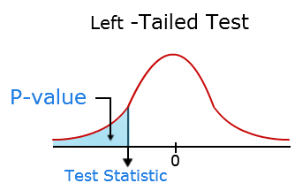

 

# Why we reject Null Hypothesis when $p \leq \alpha$?

Understanding Type I and II errors are of the fundamental importance in interpreting the results of Hypothesis Tests such as A/B testing. 

In Hypothesis Testing, we normally define (somehow arbitrary) Significance Level ($\alpha$) and use our test statistic to calcuate the associated $p$-value. When $p \leq \alpha$ we reject the Null Hypothesis, $H_0$, and do not reject it otherwise. 

The reason for rejecting $H_0$ when $p \leq \alpha$ was not clear to me. The tremendous number of resources online and offline gives us the impression that these concepts are well understood and, sometimes, we [do not have the guts](https://math.stackexchange.com/questions/582945/in-statistics-why-do-you-reject-the-null-hypothesis-when-the-p-value-is-less-th) to question them. On the other hand, studying the results of a simple Google search shows that they are some of the most confusing and misunderstood concepts. [Academic research](https://www.ncbi.nlm.nih.gov/pmc/articles/PMC2895822/) also warn against misinterpreting them:

> The concept of a $p$-value is not simple and any statements associated with it must be considered cautiously.

Here I briefly disucc what $p$-values are and how they are calculated. I use a simple example to interpret $p$-values and then  relate it to Type I error and Significance Level. It is assumed the reader is familiar with Hypothesis Testing. 

## Where does p-value come from?

According to [minitab](http://blog.minitab.com/blog/adventures-in-statistics-2/how-to-correctly-interpret-p-values)
> A $p$-value is the probability of obtaining an effect at least as extreme as the one in your sample data, assuming the truth of the null hypothesis. 

Let's elaborate on this: any variable $x$ with normal distribution can be transormed to variable $z$ with standard normal distribution using the following formula

$$
z = \frac{x - \mu}{\sigma}
$$

where $\mu$ and $\sigma$ are the mean and standard deviation of the distribution of $x$ values, respectively and $z$ is the z-score. 

The mean and standard deviation of standard normal distribution, also known as the probability density distribution (figure below) are 1 and 0, respectively, and its area curve is unity. $p$-values are obtained from the probability density distribution. 

In fact, for the test statistic $z$, the associated $p$-value is the **Cumulative Probability** of observing $z \in (-\infty, z]$ under the condition that the Null Hypothesis is true (figure below). Mathematically speaking, for any $z_0$ value, we can write $p$-value as

$$
p\big(z\in(-\infty, z_0]|H_0\big)
$$

<figcaption> Source: <a href="http://www.mathcaptain.com/statistics/p-value.html"> Mathcaptain</a></figcaption>

## Interpretation

Let's assume we want to verify the claim that for the sample mean $\bar x = \bar x_0$, the population mean is $\mu = \mu_0$. 
We start with developing the Null Hypothesis (assuming a random sample and Central Limit Theorem that leads to $\mu_{\bar x} = \mu$), 
as 

$$
H_0: \mu = \mu_0,
$$

indicating that the popuation mean is in fact equal to $\mu_0$. Assuming the Null Hypotheis is true, we then want to find out how likely is it that we can a sample with sample mean equal or smaller than $\bar {x} = \bar x_0$.  We can achive that by finding the p-value associated with the test statistic given by

$$
z_0 = \frac{\bar x_0 - \mu_0}{\sigma}
$$

Therefore, $p$ can be interpreted as the possibility/probability of observing a sample with the sample mean $\x_0$ for a population with the population mean $\mu_0$. The observation of this sample solely occurs due to [random sampling error](http://blog.minitab.com/blog/adventures-in-statistics-2/how-to-correctly-interpret-p-values), since we assumed $H_0$ is true. 
> $p$-values are calculated based on the assumptions that the null is true for the population and that the difference in the sample **is caused entirely by random chance.**

Reviewing the interpretation of $p$ above, we can 

## $p$-value and $\alpha$

Assuming $H_0$ is true, $p$ gives the probability of observing an effect (like coming up with a sample with sampling mean $\bar x_0$) [due to random sampling error](http://blog.minitab.com/blog/adventures-in-statistics-2/how-to-correctly-interpret-p-values). From here we make two important conclusions:
1. $p$ is not the probability that $H_0$ is true or false, since it is based on the assumaption that $H_0$ is true. 
2. $p$ provides a measure of observing an effect when in fact it does not exist, simply due to sampling errors.

[Therefore](https://www.ncbi.nlm.nih.gov/pmc/articles/PMC2895822/),
> Thus a p value is simply a measure of the strength of evidence against $H_0$.

On the other hand, $\alpha$ or the significance is an artificial cutpoint which is used as a measure to reject or not-reject the Null Hypothesis. Therefore, $p \leq \alpha$ means the evidence in support of $H_0$ is not strong in \alpha level and $p > \alpha$ says the evidence are strong enough not to reject $H_0$.

BETTER: when p = 3%, it means there is a 3% chance to observe an effect (solely due to the sampling error). On the other hand in $\alpha = 5%$ level we expect the randomness up to 5%. Since we cannot be up to 5% sure that the effect is solely due to random errors, we reject the assumption undelying the calculation of $p-value$. 

On the other hand, if $p > \alpha$, we claim that at $\alpha$ level, it is possible to observe those effects due to random erros. 

The statement "when the Null Hypothesis is true" is a very important assumption behind the definition of Type I error and is often overlooked.

If you have any feedback, please do not hesistate to share.
